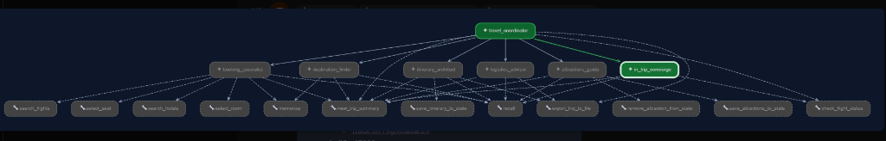
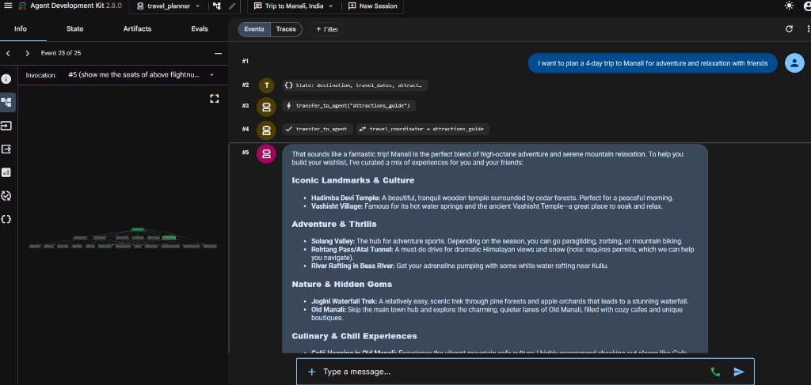
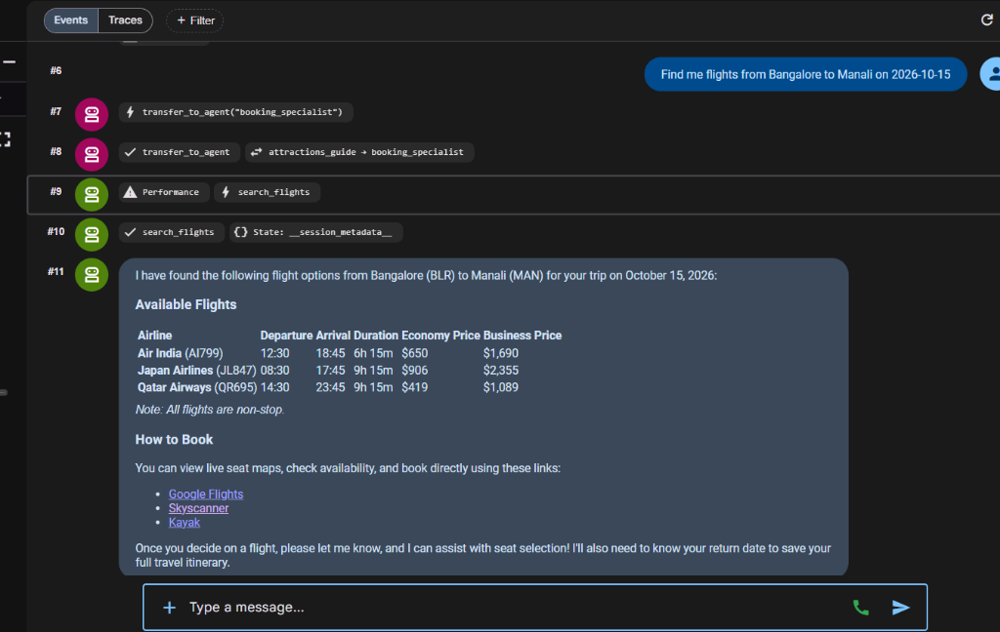
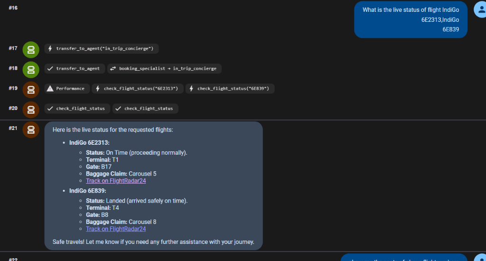
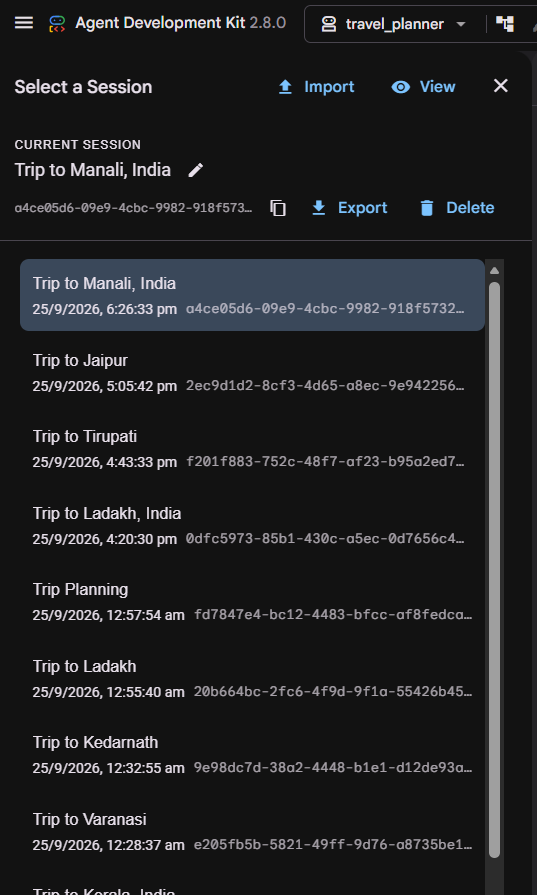

# ✈️ AI Multi-Agent Travel Planner & Concierge

An intelligent, multi-agent travel planning and in-trip concierge system powered by **Google ADK (Agent Development Kit)** and **Google Gemini**.

The system coordinates specialized autonomous agents to deliver end-to-end travel assistance: from initial destination discovery and attractions curation, to real-time flight search, hotel booking, day-by-day itinerary generation, logistics advisory, and live in-trip flight tracking.

---

## 🌟 Key Features

- **Multi-Agent Orchestration**: A hierarchical team of specialized agents coordinated seamlessly under a central root concierge.
- **Real-Time Flight Search & Booking Links**: Searches flight options across top global airlines with direct, pre-populated deep links for instant booking on **Google Flights**, **Skyscanner**, and **Kayak**, plus interactive seat selection.
- **Hotel Search & Direct Reservation**: Curates accommodation options across luxury, boutique, and value tiers with pre-filled booking links for **Booking.com**, **Expedia**, and **Google Hotels**.
- **Live In-Trip Flight Status Tracking**: Connects to the **OpenSky Network API** for live transponder telemetry, gate, terminal, and baggage carousel updates, with direct links to **FlightRadar24** live radar.
- **Dynamic Itinerary Architect**: Constructs geographically optimized, day-by-day itineraries tailored to the traveler's duration, budget, and saved attractions, with one-click export to Markdown (`saved_trips/`).
- **Automated Destination-Based Chat History**: Automatically synchronizes session metadata in the Google ADK Web UI so past and active conversations are clearly organized by destination (e.g., *Trip to Manali, India*, *Trip to Paris*, *Trip to Jaipur*, *Trip to Ladakh*).
- **Quota Resilience & Graceful Fallback**: Built-in `Graceful429Plugin` intercepts rate-limit spikes (`RESOURCE_EXHAUSTED` / HTTP 429) and provides smooth failover responses without terminating sessions.

---

## 🏛️ Multi-Agent Architecture

```
                       ┌─────────────────────────┐
                       │   Travel Coordinator    │
                       │     (Root Concierge)    │
                       └────────────┬────────────┘
                                    │
    ┌───────────────────────────────┼───────────────────────────────┐
    │               │               │               │               │
┌───▼────────┐ ┌────▼─────────┐ ┌───▼───────────┐ ┌─▼─────────────┐ ┌───▼───────────┐
│Destination │ │ Attractions  │ │    Booking    │ │   Itinerary   │ │  Logistics    │
│   Finder   │ │    Guide     │ │  Specialist   │ │   Architect   │ │   Advisor     │
└────────────┘ └──────────────┘ └───────────────┘ └───────────────┘ └───────────────┘
                                    │
                             ┌──────▼────────┐
                             │    In-Trip    │
                             │   Concierge   │
                             └───────────────┘
```

### Live Agent Execution Graph


### Specialized Agents & Roles

1. **Travel Coordinator** (`travel_coordinator`):
   - Central conductor that greets travelers, determines intent, delegates to specialized agents, and ensures seamless cross-agent handoffs.
2. **Destination Finder** (`destination_finder`):
   - Helps travelers brainstorm and select destinations based on travel style, party size, season, and budget tier.
3. **Attractions Guide** (`attractions_guide`):
   - Recommends must-see sights, cultural heritage, culinary hotspots, and maintains a persistent attraction wishlist.
4. **Booking Specialist** (`booking_specialist`):
   - Handles real-time flight searches, seat assignments, hotel searches, room selections, and provides instant booking engine links.
5. **Itinerary Architect** (`itinerary_architect`):
   - Organizes saved sights and travel schedules into geographically clustered morning/afternoon/evening day-by-day plans.
6. **Logistics Advisor** (`logistics_advisor`):
   - Provides on-the-ground logistics: airport transit, local passes, currency tips, packing checklists, and local etiquette.
7. **In-Trip Concierge** (`in_trip_concierge`):
   - Supports travelers during their journey with real-time flight status checks, terminal/gate numbers, and delay alerts.

---

## 📸 Working Model in Action

### 1. Destination Discovery & Attractions Guide
When planning a trip, the `attractions_guide` curates categorized points of interest (landmarks, adventure thrills, hidden gems, culinary experiences) and maintains the traveler's wishlist:



---

### 2. Real-Time Flight Search & Live Booking Links
The `booking_specialist` searches flight schedules and real-world prices across major airlines, providing instant deep links to **Google Flights**, **Skyscanner**, and **Kayak** for direct checkout and live seat map selection:



---

### 3. In-Trip Concierge & Live Radar Tracking
Travelers can check live flight status during transit to get real-time gate, terminal, and baggage claim updates, along with a direct link to track the aircraft on **FlightRadar24**:



---

### 4. Destination-Based Chat History (ADK Web UI)
Every session is automatically indexed and displayed in the sidebar by destination place (e.g., *Trip to Manali, India*, *Trip to Jaipur*, *Trip to Tirupati*, *Trip to Ladakh*), making it effortless to revisit past itineraries:



---

## 🛠️ Tool Ecosystem

| Tool | Module | Description |
| :--- | :--- | :--- |
| `search_flights` | `tools.flights` | Real-time flight search with live pricing, airline fleets, and deep links to Google Flights, Skyscanner, Kayak. |
| `select_seat` | `tools.flights` | Interactive seat selection across Economy, Business, and First Class cabins. |
| `check_flight_status` | `tools.flights` | Live flight status lookup with OpenSky Network API integration and FlightRadar24 links. |
| `search_hotels` | `tools.hotels` | Live hotel availability search with pricing, ratings, amenities, and direct reservation links. |
| `select_room` | `tools.hotels` | Room category selection and reservation holding. |
| `memorize` / `recall` | `tools.memory` | Stateful preference and booking memory persisted across the entire session. |
| `save_itinerary_to_state` | `agent` | Records completed day-by-day itineraries into persistent state. |
| `export_trip_to_file` | `agent` | Exports complete itineraries and travel guides into formatted Markdown files under `saved_trips/`. |
| `view_trip_summary` | `agent` | Instant snapshot of current destination, booked flights, hotels, and attractions. |

---

## 📂 Project Structure

```
Travel-Planner/
├── assets/                           # Screenshots & working model visual assets
│   ├── agent_graph_architecture.png
│   ├── destination_attractions_planning.png
│   ├── destination_sessions_sidebar.png
│   ├── flight_search_booking.png
│   └── live_flight_radar_tracking.png
├── adk_multiagent_systems/
│   ├── callback_logging.py           # Safe console logging with Windows encoding support
│   └── travel_planner/
│       ├── __init__.py
│       ├── agent.py                  # Core agent definitions, coordinator, & callbacks
│       └── tools/
│           ├── __init__.py
│           ├── flights.py            # Flight search, booking links, & live radar tracking
│           ├── hotels.py             # Hotel search & reservation links
│           └── memory.py             # Stateful memory persistence & session title sync
├── adk_utils/
│   ├── __init__.py
│   └── plugins.py                    # Graceful 429 quota resilience plugin
├── saved_trips/                      # Exported markdown itinerary files
├── .env.example                      # Template for API keys
├── .gitignore                        # Git exclusion rules for secrets & cache
├── requirements.txt                  # Python dependencies
└── README.md                         # Project documentation
```

---

## 🚀 Quick Start Guide

### 1. Prerequisites
- **Python 3.10+** (Python 3.11 recommended)
- A **Google Gemini API Key** from [Google AI Studio](https://aistudio.google.com/)

### 2. Clone the Repository
```bash
git clone https://github.com/hemu2205/Travel-Planner-agent.git
cd Travel-Planner-agent
```

### 3. Create & Activate Virtual Environment
```bash
# Windows
python -m venv .venv
.venv\Scripts\activate

# macOS / Linux
python3 -m venv .venv
source .venv/bin/activate
```

### 4. Install Dependencies
```bash
pip install -r requirements.txt
```

### 5. Configure Environment Variables
Copy `.env.example` to `.env` and insert your API credentials:
```bash
cp .env.example .env
```
Edit `.env`:
```env
MODEL=gemini-3.1-flash-lite
GEMINI_API_KEY=your_actual_gemini_api_key_here
GOOGLE_API_KEY=your_actual_gemini_api_key_here
```

### 6. Launch the Application

#### Option A: Web User Interface (Google ADK Web UI)
```bash
python -m google.adk.cli web --port 8000 adk_multiagent_systems
```
Open **[http://127.0.0.1:8000](http://127.0.0.1:8000)** in your browser. All conversations will be automatically organized by destination in the sidebar.

#### Option B: Terminal Interactive Mode
```bash
python -m google.adk.cli run adk_multiagent_systems
```

---

## 💡 Example Queries to Try

- *"I want to plan a 4-day trip to Manali for adventure and relaxation with friends."*
- *"Find me flights from Bangalore to Manali on 2026-10-15."*
- *"What is the live status of flight IndiGo 6E2313?"*
- *"Search for boutique hotels in Rome for next week."*
- *"Build a 3-day day-by-day itinerary for Ladakh and export it to a file."*
- *"What are the local transportation options and etiquette tips for visiting Kyoto?"*

---

## 🛡️ License

This project is licensed under the MIT License - see the LICENSE file for details.
